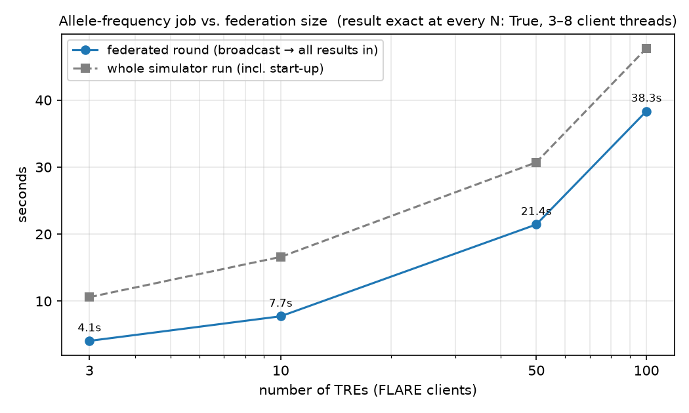

<p align="center">
  
</p>

<p align="center">
  <b>Run one analysis across many Trusted Research Environments. No record ever leaves its TRE.</b><br>
  <sub>Named after the watchman who guards the bridge Bifrost: sees a hundred leagues, hears the grass grow, lets nothing cross without his say.</sub>
</p>

<p align="center">
  <a href="https://github.com/collaborativebioinformatics/Bifrost/actions/workflows/ci.yml"></a>
  
  
  
  <a href="LICENSE"></a>
</p>

---

Each Trusted Research Environment (TRE) keeps its own data, its own API and its own column names. A researcher writes **one** analysis in canonical variable names; a FLARE client inside every TRE translates it through an adapter, runs it against the native API, filters the output for disclosure risk, and sends back **aggregates only**. An NVIDIA FLARE server outside all TREs merges them, checks the merged result again, and either releases it or holds it for a human overseer.

| Use case | What leaves each TRE | What you get |
| --- | --- | --- |
| **Allele frequency** | disclosure-checked genotype counts | federated allele frequencies, exact |
| **Linear regression** | OLS sufficient statistics, or β per round | exact federated OLS, or FedAvg |
| **Logistic regression** | per-round gradient and Hessian of the log-likelihood | Newton-Raphson / IRLS, exact to the pooled MLE |

Built by Team 1 at the NCFH 2026 hackathon. Three mock TREs with deliberately different APIs (REST, DataSHIELD-style, SQL) stand in for real sites; the same code runs in-process, in the FLARE simulator, as a real mTLS federation on one machine, and in Docker.

## Quick start

Python 3.11 or 3.12, Bash, macOS or Linux, from the repository root:

```sh
pip install -e ".[dev]"
python data/generate.py                       # 30 000-row synthetic cohort, split non-IID over the sites in sites.yaml
scripts/local_federation.sh up                # provisioned FLARE server + one client per TRE, separate processes, mTLS
scripts/local_federation.sh job spec/examples/allele_freq.json
scripts/local_federation.sh job spec/examples/fed_linreg.json --fedavg --rounds 10
scripts/local_federation.sh job spec/examples/fed_logreg.json --rounds 25
scripts/local_federation.sh down
```

Every job prints its coverage (`3/3 sites`), a verification table against the pooled ground truth, and the overseer queue.

**Researcher UI** (three terminals):

```sh
python scripts/dev_tres.py                                          # the mock TREs
SERVER_OUT=server/api_out uvicorn server.api:app --port 8500        # HTTP API, OpenAPI at /docs
cd frontend && npm install && npm run dev                           # Next.js UI on :3000
```

<details>
<summary>Other launch modes, tests and verification</summary>

The fast suite needs no network; the FLARE simulator suite is marked `slow`:

```sh
python -m pytest -q -m "not slow"    # 111 tests, ~3 s
python -m pytest -q -m slow          # 4 tests, ~70 s
```

Launch modes are alternatives, not steps. `scripts/dev_tres.py` takes ports 8001–8003; `sites.yaml` gives the FLARE server 8002/8003. Stop `dev_tres.py` before the real federation or Docker: both start their own TREs.

**Direct adapters (development only)** — no server disclosure check, no overseer; one failing TRE aborts the run:

```sh
python scripts/dev_tres.py
python scripts/run_local.py spec/examples/allele_freq.json
```

**FLARE simulator** — one process, real controllers and executors. Each run writes `server/out/<spec_hash>/result.json`; `released.json` appears only when the disclosure check passes or an overseer approves, and is what would leave the server. Directories are keyed by spec hash, so an earlier `released.json` can outlive a later flagged run of the same spec — `check.json` holds the current decision.

```sh
scripts/run_job.sh spec/examples/allele_freq.json
python scripts/verify.py server/out/<spec_hash>/result.json
```

`verify.py` compares whatever the merged result contains with the pooled truth: allele frequencies even under partial coverage (truth recomputed over the reporting sites), means and coefficients only when every site reported. Suppressed statistics are skipped, so a run that released nothing can still `PASS`; filtered specs are printed for information only and exit zero. Any deviation beyond `--tol` exits non-zero.

**Docker** — builds the TRE and FLARE images, puts each TRE on its own `internal: true` network with only its FLARE client also on `federation`, health-checks every TRE from its client container and asserts no TRE can reach the public internet. Jobs are submitted inside the server container; `server/out/` is a host bind mount.

```sh
scripts/provision.sh && scripts/up.sh --flare
docker compose exec flare-server python scripts/run_job.py --mode prod --admin-kit "/workspace/federated_apis/prod_00/admin@ncfh.org" spec/examples/allele_freq.json
python scripts/verify.py server/out/41174610ab2bece0/result.json
scripts/up.sh --down
```

**Cloud** — server on a VM, sites anywhere, kits pasted through a browser terminal: [docs/cloud_demo.md](docs/cloud_demo.md).

`spec/examples/` holds allele frequency, a filtered variant, a safe-output rejection case, federated linear regression and federated logistic regression ([docs/demo_specs.md](docs/demo_specs.md)).
</details>

## How it works

<p align="center">
  
</p>

1. **Request** — a JSON `AnalysisSpec` in canonical variable names; hashed, and that hash keys every log.
2. **Dispatch** — the FLARE server sits outside every TRE; clients dial **out** over mTLS gRPC. No inbound ports in a secure environment.
3. **Local execution** — the FLARE client loads the adapter for its own `tre_id` and speaks the TRE's native API (REST, DataSHIELD-style, SQL gateway). Adapters can ask only for schema metadata and five aggregate primitives: `count`, `describe`, `value_counts`, `gram`, `irls_step`.
4. **Safe output** — inside the TRE, before the FLARE client sees anything: project allow-list, aggregate allow-list, `n < k` ⇒ nothing leaves, cell `< k` suppressed (and anything derivable from it), one audit line per request and per round.
5. **Aggregation** — everything the server merges is a sum (counts, Gram matrices, gradients and Hessians, n-weighted β), so merging is exact, order-free and straggler-tolerant: `min_clients` + `wait_time`, never wait-for-all; a missing site is reported as `2/3 sites`.
6. **Disclosure check and release** — on the merged table: minimum cell size, dominance, ≥ 2 sites, site-level suppressions, differencing against earlier releases. Pass ⇒ `released.json`; flag ⇒ overseer queue, human decision logged.

[Edit the diagram](docs/architecture/flowchart.drawio) · [Original external diagram](https://drive.google.com/file/d/1j9t8W-cFVBYgHGrFrLGP5keU2vaFtE-l/view?usp=sharing)

## Results

Measured on a real local federation (`local_federation.sh`), 30 000-row synthetic cohort split non-IID across three sites with different column names and APIs, 2026-09-17. Full figures, scenario detail and caveats: [docs/results.md](docs/results.md).

| Scenario | Outcome |
| --- | --- |
| Allele frequency, 5 SNPs, 3 sites | identical to pooled ground truth (error 0) |
| Linear regression, exact (summed Gram matrices) | max coefficient error 1.7e-11 vs pooled OLS |
| Linear regression, FedAvg, 10 rounds (only β leaves) | 2.2e-11; five local steps per round leave a ~2.3e-2 residual — the classic non-IID bias ([controlled comparison](docs/local_steps_controlled.md)) |
| Logistic regression, Newton-Raphson / IRLS | exact to the pooled MLE |
| Deliberate rejection (`min_cell_size: 100`) | every site withholds the small cell and the derived allele counts; server flags, overseer approves, release logged |
| One client killed / one container stopped | `2/3 sites`, still exact for the reporting sites, nobody waited |
| 3 → 100 simulated TREs | exact at every N; merging 100 results < 1 ms |

<p align="center">
  
</p>

The evidence is synthetic and single-machine (plus Docker). Nobody has yet run clients on remote Gefion or NextCloud hosts.

## Adding a TRE

`sites.yaml` is the only place sites exist; `docker-compose.yml`, `flare/project.yml`, certificates and kits are generated from it.

```sh
scripts/onboard_tre.sh <tre_id> [adapter] [api_url] [region]
```

That registers the site, regenerates everything, provisions the project CA, packs `flare/kits/<tre_id>.tgz` and prints the one firewall rule the TRE needs: outbound TCP to the FLARE server, nothing inbound.

<details>
<summary>Remote hosts, new API styles, new variable names</summary>

Set `server.host` in `sites.yaml` to an address the TRE can reach **before** onboarding; the kit contains the address set when it was packed (`flare-server` is Docker DNS). The archive holds only the mTLS client kit, so the TRE host also needs a checkout with dependencies. There:

```sh
scripts/kit_import.sh <tre_id>                       # paste the kit printed by scripts/kit_export.sh on the server
scripts/start_site.sh <tre_id> .remote/<tre_id>      # mock TRE + FLARE client; or sbatch scripts/slurm_site.sbatch
```

Re-run `python data/generate.py` to re-split the synthetic cohort for the new site count. A new API style is one adapter class implementing the five primitives plus a registry entry; a different local variable name is one `local:` line in [`harmonisation/canonical.yaml`](harmonisation/canonical.yaml) (unlisted sites use the canonical name).

Intended final topology: one client on Gefion, one on NextCloud, server on Brev or AWS — [docs/cloud_demo.md](docs/cloud_demo.md). A client on HUNT Cloud needs a network-opening request first: [runbook section 4](docs/cloud_demo.md#4-site-on-hunt-cloud-optional).
</details>

## Five Safes

| Safe | Mechanism |
|---|---|
| **Projects** | `project_id` must be in [`projects.yaml`](projects.yaml); otherwise nothing is computed and the refusal is audited |
| **People** | provisioned FLARE identities — every client and admin holds an mTLS certificate signed by the project CA |
| **Settings** | TRE containers read-only, data mounted `:ro`, internal-only network; only the FLARE client dials out — `scripts/up.sh` asserts a TRE cannot reach the internet |
| **Data** | canonical variables only; adapters never see rows, and each mock API refuses row-level requests on its own |
| **Outputs** | two layers — site filter ([`adapters/safe_output.py`](adapters/safe_output.py)) and server check ([`server/disclosure_check.py`](server/disclosure_check.py)); flagged results wait in [`server/overseer_queue.py`](server/overseer_queue.py) for a logged human decision |

## Repository map

| Path | Contents |
|---|---|
| [`sites.yaml`](sites.yaml), [`projects.yaml`](projects.yaml), [`harmonisation/canonical.yaml`](harmonisation/canonical.yaml) | sites, approved projects, canonical → local variable map ([dictionary](docs/variables.md)) |
| [`spec/`](spec) | `AnalysisSpec` and example specs |
| [`adapters/`](adapters) | one adapter per API style behind a registry; the Safe Output filter; the TRE→server wire contract |
| [`tres/`](tres) | the three mock TREs and their Dockerfiles |
| [`flare/app/`](flare/app) | FLARE controllers and executors (allele frequency / statistics, linear and logistic regression) |
| [`server/`](server) | associative merge, disclosure check, overseer queue, HTTP API and its schemas ([`docs/schemas/`](docs/schemas)) |
| [`frontend/`](frontend) | Next.js researcher, overseer and audit UI |
| [`scripts/`](scripts) | generate, provision, onboard, local federation, Docker, cloud bootstrap, verify, scale simulation |
| [`docs/`](docs/README.md) | results, variable dictionary, demo specs, cloud runbook, roadmap, build plan |

## Status

Milestones M0–M6 of the [build plan](docs/BUILD_PLAN.md) are implemented; the original goals are kept as a [roadmap](docs/roadmap.md).

| Component | State |
| --- | --- |
| Mock TREs, adapters, registry, Safe Output filter, audit log | implemented, tested |
| Analysis spec, Safe Projects allow-list, typed wire contracts | implemented, tested; JSON Schema + OpenAPI in `docs/schemas/` |
| FLARE jobs — allele frequency, federated statistics, linear (exact + FedAvg) and logistic (Newton-Raphson) regression | implemented, simulator-tested, verified against ground truth |
| Server merge, disclosure check, overseer queue | implemented, tested |
| Real FLARE federation (separate mTLS processes) on one machine | verified — `scripts/local_federation.sh` |
| Docker — 7 images, isolated TRE networks, containerised server and clients | verified — `scripts/up.sh --flare`, stopped container ⇒ `2/3 sites` |
| Scale — 3, 10, 50, 100 simulated sites | verified — `docs/scaling.png` |
| HTTP API — [`server/api.py`](server/api.py) | implemented, tested: `/metadata`, `/examples/{name}`, `POST /run`, `/run/{id}`, `/overseer`, `/overseer/{hash}/approve|reject`, `/audit`, plus `/allele-frequency`, `/linear-regression`, `/logistic-regression` (≤ 100 sequential rounds per site) |
| Researcher UI — [`frontend/`](frontend) | connected to the API end to end (run, released result, overseer queue, audit log) |
| Clients on remote hosts (Gefion, NextCloud, AWS server) | scripts ready ([runbook](docs/cloud_demo.md)), not yet run |

## Team

Team 1, NCFH 2026 hackathon — Ioannis Christofilogiannis · Gaurang Sharma · Marta Menta Czinkoczky · Udogwu Emiri · Pedro Gabriel Campana · Vitalii Babenko · Melissa Wong · Espen Hagen

Released under the [MIT License](LICENSE).
