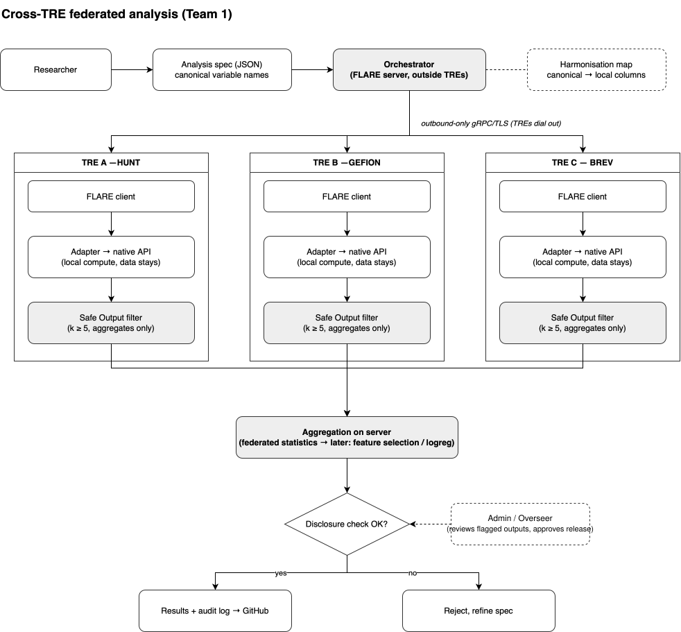

# Federated_APIs

Cross-TRE federated analysis: run an analysis across several Trusted Research Environments (TREs) without moving any record-level data. Each TRE computes locally behind its own native API and returns only disclosure-checked aggregates; the orchestrator combines them.

## Team

- Ioannis Christofilogiannis
- Gaurang Sharma
- Marta Menta Czinkoczky
- Udogwu Emiri
- Pedro Gabriel Campana
- Vitalii Babenko
- Melissa Wong
- Espen Hagen

## Architecture

Diagram source: [flowchart.drawio](https://drive.google.com/file/d/1j9t8W-cFVBYgHGrFrLGP5keU2vaFtE-l/view?usp=sharing)

### Flow

1. **Request** — researcher submits an analysis spec (JSON) using canonical variable names; the orchestrator resolves them to each site's local columns via the harmonisation map.
2. **Dispatch** — the orchestrator (FLARE server) sits outside every TRE. TREs dial out over gRPC/TLS, so no inbound ports are opened in the secure environments.
3. **Local execution** — each TRE runs a FLARE client with an adapter onto its native API (REST, DataSHIELD/R, SQL gateway). Compute happens where the data is; record-level data never leaves.
4. **Safe output** — each site filters results before they leave: aggregates only, small-count suppression (k ≥ 5).
5. **Aggregation** — the server combines site results into federated statistics; feature selection and logistic regression follow later.
6. **Disclosure check** — passing results plus an audit log are published; failures are rejected and the spec is refined.

## Goals

### 0. Simulate TREs
- with various levels of security

### 1. Federated Infrastructure
1.1. Create client + server kits (certificates)

1.2. Distribute them

1.3. Connect them via IP addresses

### 2. A simple ML/AI training task
Use case: Calculate Allele Frequency & Linear Regression

- Use case 1: Calculate Allele Frequency
  federated analysis — computation happens inside each TRE; aggregate statistic leaves.
- Use case 2: Linear regression 
  federated learning — training happens inside each TRE; model information leaves.
- Use case X: iterative model training (DL or similar)

[View API Architecture Use Case](API_architecture_use_case.txt)

                 federation_client.py
                         │
               ┌─────────┴─────────┐
               │                   │
        federated analysis   federated learning
               │                   │
       GET allele freq         POST train
               │                   │
       ┌───────┼───────┐   ┌───────┼───────┐
       ↓       ↓       ↓   ↓       ↓       ↓
      TRE1    TRE2    TRE3 TRE1    TRE2    TRE3
       │       │       │   │       │       │
      DB      DB      DB   DB      DB      DB
       🔒      🔒      🔒   🔒      🔒      🔒
       │       │       │   │       │       │
     counts  counts  counts β₁    β₂      β₃
       └───────┼───────┘   └───────┼───────┘
               ↓                   ↓
          aggregate          aggregate model
          
ML jobs:
- Select dataset and distribute it
- Create a simulated NVFlare job
- Distribute the job to clients
- Run the job on the connected clients

### 3. Weights aggregation
- Collect model weights from each TRE after local training
- Aggregate the local weights on the FLARE server using FedAvg
- Generate a single global model from the aggregated weights
- Redistribute the global model to participating TREs
- Run a small number of federated training rounds and track the results
- Log the aggregation process without exposing local data

### 4. Interface that allows API usage for non-technical users

### 5. Deployment on real-world TREs
- HUNT Cloud clients (multiple users)
- Gefion clients (multiple users)
- Server for model aggregation (Brev or AWS)
- Admin - FLARE Dashboard/deployment kits (Brev or AWS)

### X. Nice interface
- User interface that allows API Usage for non-technical users
